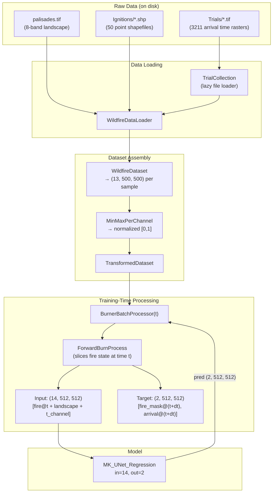

# WildfireSimulator

## Environment
```bash
conda create -f environment.yml
conda activate wildfire_env
pip install -e .
pip uninstall torch torchvision
pip install torch torchvision --index-url https://download.pytorch.org/whl/cu126 # or thru here: https://pytorch.org/get-started/locally/
```

## Data
Data is not traditionally saved in a `.npy` file for training. Rather, `.tifs` are directly converted into the correct format for training in RAM through a DataLoader. Create a `.env` file that points to these tifs:

```bash
LANDSCAPE=/run/media/hrotovb001/9021-552E/FireDataset/palisades.tif
TRIALS=/run/media/hrotovb001/9021-552E/FireDataset/Trials/
IGNITIONS=/run/media/hrotovb001/9021-552E/FireDataset/Ignitions/
```

Currently there are 3112 samples. Each on the Palisades landscape, with parameterized:
- Ignition point (ign)
- Wind speed (ws)
- Wind direction (wd)
- Moisture (moisture)



## Run training
Simply through `python run.py`.
